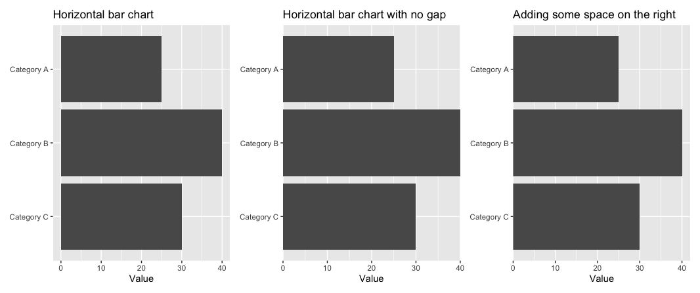

A collection of practical R code snippets that solve (my) common data visualization and analysis situations.

* See also Allison Koh's collection: [https://github.com/allisonkoh/helpful-code-stuff](https://github.com/allisonkoh/helpful-code-stuff)
* Silvia Kim's workshop notes are [here](https://sysilviakim.com/learningR/).

## Data Visualization with ggplot2

### Fix Legend Order Mismatches
When your legend colors don't match your data order:
```r
# Reverse legend order to match data
guides(fill = guide_legend(reverse = TRUE))
guides(color = guide_legend(reverse = TRUE))
```
**When to use:** Your categorical data appears in one order but the legend shows colors in reverse order.

### Wrapping long labels

#### Sub-plots produced by `facet_wrap()` have long labels

Solution:

`facet_wrap(~ var, labeller = label_wrap_gen(width = 30)`

And you can make the text smaller with `theme(strip.text = element_text(size = 9)`

#### The legend has excessively long labels

Solution:

```
scale_fill_manual(name = "Legend Title",
values = c("A" = "#1b9e77", "B" = "#d95f02", "C" = "#7570b3"),
  labels = function(x) str_wrap(x, width = 20))
```

#### Handle Axis Labels

Wrap long labels to specified width; **When to use:** Category names or labels are too long and overlap on your plots.

```r
scale_x_discrete(labels = scales::label_wrap(20))
```

(This is often preferred, I think, compared to tilting, but in an emergency you can go with `theme(axis.text.x = element_text(angle = 45, hjust = 1, vjust = 1))`)

Bonus tip: Make your (long) numbers a bit nicer:

`scale_y_continuous(labels = scales::comma)`

### Better Title Positioning

**When to use:** Default title positioning leaves awkward spacing or you run out of space...

Move title to plot area edge for more space:

```r
theme(plot.title.position = "plot")
```

### Getting rid of awkward padding



To fix the first plot and create the third plot, add:

`scale_x_continuous(expand = c(0, 0),limits = c(0, 42))`

(The important part is using `expand = c(0, 0)`. The code is [here](https://gist.github.com/zilinskyjan/d359158163621c4b744588ee1bc73f93).)

### Getting rid of (some) gridlines

```r
theme_minimal() +
theme(panel.grid.major.y = element_blank(),
       panel.grid.minor = element_blank(),
       plot.title = element_text(size = 14, face = "bold"),
       axis.text = element_text(size = 11)
```

### Control Legend Visibility

Hide legends for specific geoms: `geom_XYZ(show.legend = FALSE)`

For example:

```r
geom_text(show.legend = FALSE)
```

**When to use:** Need to remove unwanted legend entries.

### Transparent Colors

`scales::alpha("blue", 0.5)  # 50% transparent blue`

**When to use:** Overlapping points or areas where you need to see underlying data.

### Custom Date Axis Formatting

Format dates with custom breaks and labels

```r
scale_x_date(
  name = NULL,  
  breaks = scales::breaks_width("2 years"),
  labels = scales::label_date("'%y") 
)
```

## Data Manipulation

### Subset Data Within ggplot
```r
ggplot(data, aes(x = var1, y = var2)) +
  stat_smooth(
    method = "loess",
    se = FALSE,
    data = . %>% filter(!is.na(var2))  # Remove NAs for this layer only
  )
```
**When to use:** You need different data filtering for specific plot layers without modifying your main dataset.

### Generate Prediction Values for Effects Plots

Create sequence for smooth predictions

```r
mod <- lm(y ~ var1 + var2, data = D)
ggeffects::ggpredict(mod, terms = "var1 [1:10 by=0.1]")
```

**When to use:** Creating smooth effect plots or predictions across a range of values.

### Summary Statistics with Confidence Intervals
```r
data %>%
  group_by(group_var) %>%
  summarize(
    mean_val = mean(x, na.rm = TRUE),
    lower_ci = quantile(x, prob = 0.025, na.rm = TRUE),
    upper_ci = quantile(x, prob = 0.975, na.rm = TRUE),
    n_obs = sum(!is.na(x))
  )
```
**When to use:** Need descriptive statistics with confidence intervals for grouped data.

### Filter by Minimum Observations
```r
analysis_data <- raw_data %>%
  group_by(group1, group2) %>%
  summarize(
    n_complete = sum(!is.na(var1) & !is.na(var2)),
    correlation = ifelse(n_complete > 5, 
                        cor(var1, var2, use = "complete.obs"), 
                        NA)
  )
```
**When to use:** Calculating statistics but only for groups with sufficient sample sizes to avoid unreliable estimates.

Accessing publicly available research datasets for reproducible analysis.

## External Data Access

### Harvard Dataverse Integration
```r
# Set up connection to Harvard Dataverse
Sys.setenv("DATAVERSE_SERVER" = "dataverse.harvard.edu")

# Download dataset directly into R
dataset <- dataverse::get_dataframe_by_name(
  "filename.tab",
  "doi:10.7910/DVN/XXXXXX"  # Replace with actual DOI
)
```

See more here: [https://cran.r-project.org/web/packages/dataverse/vignettes/A-introduction.html](https://cran.r-project.org/web/packages/dataverse/vignettes/A-introduction.html)
